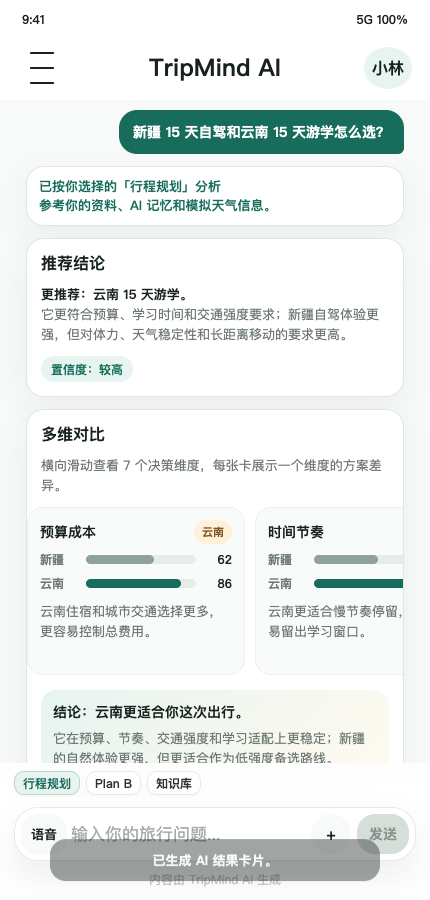
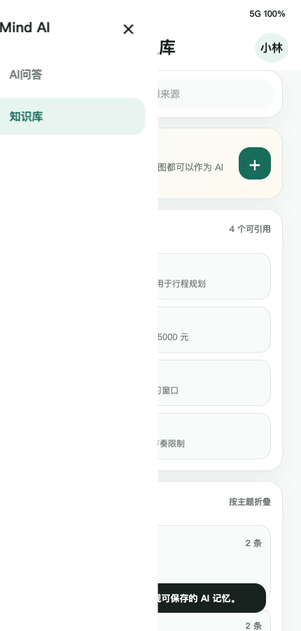
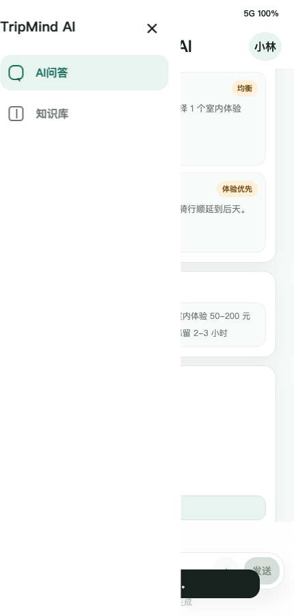

# TripMind AI 页面原型提交版

## 1. 文档说明

本文档作为作业交付物中的“页面原型”部分，包含：

- 核心页面线框图。
- AI 与用户互动方式。
- 输入方式、反馈机制和结果呈现。
- AI Coding 可交互原型截图。
- Demo 访问和外部分享方式。

当前页面原型为低保真移动端 App 原型，重点展示核心交互流程和 AI 输出结构，不追求完整商业化视觉稿。

## 2. 原型范围

本原型覆盖以下页面和状态：

| 页面 / 状态 | 说明 |
| --- | --- |
| 启动首页 | 建立产品第一印象，引导用户点击“出发” |
| AI 问答首页 | 统一 AI 入口，支持自然语言输入和模式选择 |
| 行程规划结果 | 展示推荐结论、横向滑动多维对比、备选方案、来源与不确定项 |
| 知识库管理页 | 展示资料源、AI 记忆分组和记忆确认 |
| Plan B 结果 | 展示突发影响判断、替代方案、成本变化、执行确认清单 |
| 左侧菜单 | 在 AI 问答和知识库之间切换 |

## 3. 页面 1：启动首页

### 3.1 线框图

```text
┌────────────────────────────────┐
│ 9:41                    5G 100% │
│                                │
│ TM  TripMind AI                │
│     游学差旅助手                │
│                                │
│        纸飞机轨迹               │
│                                │
│ 向着阳光出发，让每份游学灵感都   │
│ 变成值得期待的旅程。             │
│                                │
│ 整理攻略、记住偏好、对比方案，   │
│ 陪你找到更适合的下一站。         │
│                                │
│ ┌────────────────────────────┐ │
│ │       背包客旅行视觉图       │ │
│ └────────────────────────────┘ │
│                                │
│ ┌────────────────────────────┐ │
│ │            出发             │ │
│ └────────────────────────────┘ │
└────────────────────────────────┘
```

### 3.2 交互说明

- 用户打开 App 后先看到启动首页。
- 首页只传达产品定位，不堆叠复杂功能。
- 点击“出发”进入 AI 问答主入口。

### 3.3 AI Coding 原型图


## 4. 页面 2：AI 问答主入口

### 4.1 线框图

```text
┌────────────────────────────────┐
│ 9:41                    5G 100% │
├────────────────────────────────┤
│  ☰          TripMind AI    小林 │
│                                │
│  [纸飞机图标]  我是 TripMind AI │
│              陪你规划游学、对比 │
│              方案、处理途中变化 │
│                                │
│  [新疆 15 天自驾和云南 15 天游学怎么选？] │
│  [预算 1.5 万，怎样安排更稳妥？]          │
│  [遇到天气变化，帮我生成 Plan B。]        │
│                                │
├────────────────────────────────┤
│ [行程规划] [Plan B] [知识库]    │
│ ┌────────────────────────────┐ │
│ │ 语音  输入你的旅行问题... + 发送 │ │
│ └────────────────────────────┘ │
│        内容由 TripMind AI 生成  │
└────────────────────────────────┘
```

### 4.2 交互说明

- AI 问答是所有 AI 能力的统一入口。
- 用户可以直接输入自然语言问题。
- 用户也可以手动点亮输入框上方的模式按钮：
  - 行程规划
  - Plan B
  - 知识库
- 如果用户不手动选择模式，系统根据关键词和上下文自动识别。
- 输入框回车发送，`Shift + Enter` 换行。
- 附件入口用于模拟上传攻略、表格、截图等资料。

## 5. 页面 3：行程规划结果

### 5.1 线框图

```text
┌────────────────────────────────┐
│ 用户：新疆和云南怎么选？        │
│                                │
│ 已按「行程规划」分析            │
│                                │
│ ┌────────────────────────────┐ │
│ │ 推荐结论                    │ │
│ │ 更推荐：云南 15 天游学       │ │
│ │ 置信度：较高                 │ │
│ └────────────────────────────┘ │
│                                │
│ ┌────────────────────────────┐ │
│ │ 多维对比                    │ │
│ │ 横向滑动查看 7 个决策维度    │ │
│ │ ┌────────────┐ ┌─────────  │ │
│ │ │预算成本 云南│ │时间节奏   │ │
│ │ │新疆 62     │ │新疆 58    │ │
│ │ │云南 86     │ │云南 88    │ │
│ │ └────────────┘ └─────────  │ │
│ │ 结论：云南更适合你这次出行。 │ │
│ └────────────────────────────┘ │
│                                │
│ ┌────────────────────────────┐ │
│ │ 备选方案                    │ │
│ │ A 云南慢节奏游学             │ │
│ │ B 新疆低强度版本             │ │
│ └────────────────────────────┘ │
│                                │
│ ┌────────────────────────────┐ │
│ │ 来源与不确定项              │ │
│ │ [查看来源] [查看不确定项]     │ │
│ └────────────────────────────┘ │
└────────────────────────────────┘
```

### 5.2 交互说明

- 结果不以长文本展示，而是拆成卡片。
- 多维对比采用横向滑动维度卡片，减少纵向滚动长度。
- 每张维度卡展示一个决策维度，包括新疆评分、云南评分、胜出标签和简短理由。
- 来源与不确定项默认折叠，用户需要时可展开。

### 5.3 AI Coding 原型图



## 6. 页面 4：知识库管理页

### 6.1 线框图

```text
┌────────────────────────────────┐
│ ☰             知识库       小林 │
│                                │
│ ┌────────────────────────────┐ │
│ │ 搜索  搜索资料、偏好、引用来源 │ │
│ └────────────────────────────┘ │
│                                │
│ ┌────────────────────────────┐ │
│ │ 上传资料                 + │ │
│ │ 攻略、预算、课程计划、票务截图 │ │
│ │ 都可以作为 AI 回答依据       │ │
│ └────────────────────────────┘ │
│                                │
│ ┌────────────────────────────┐ │
│ │ 资料源              4 个可引用 │ │
│ │ PDF 云南游学攻略.pdf         │ │
│ │ 表  个人预算计划.xlsx        │ │
│ │ 图  课程安排截图             │ │
│ └────────────────────────────┘ │
│                                │
│ ┌────────────────────────────┐ │
│ │ AI 记忆              按主题折叠 │ │
│ │ ▾ 预算与时间             2 条 │ │
│ │ ▸ 饮食与身体限制         2 条 │ │
│ │ ▸ 目的地偏好             2 条 │ │
│ └────────────────────────────┘ │
│                                │
│ ┌────────────────────────────┐ │
│ │ 发现可保存的 AI 记忆         │ │
│ │ □ 总预算不超过 15000 元       │ │
│ │ □ 每天保留 2 小时学习时间     │ │
│ │ [全部保存] [逐条确认]         │ │
│ └────────────────────────────┘ │
└────────────────────────────────┘
```

### 6.2 交互说明

- 知识库分为“资料源”和“AI 记忆”。
- 资料源用于支持 AI 回答引用。
- AI 记忆用于保存长期偏好和约束。
- 上传资料后，AI 模拟解析资料并提出记忆候选。
- 长期记忆必须用户确认后保存。

### 6.3 AI Coding 原型图



## 7. 页面 5：Plan B 结果

### 7.1 线框图

```text
┌────────────────────────────────┐
│ 用户：明天大理下雨，环洱海骑行怎么办？ │
│                                │
│ 已按「Plan B」分析              │
│ 突发类型：天气变化影响户外活动   │
│                                │
│ ┌────────────────────────────┐ │
│ │ 影响判断                    │ │
│ │ 明天大理降雨会影响环洱海骑行 │ │
│ │ 建议：不要执行完整骑行        │ │
│ │ 置信度：中等偏高             │ │
│ └────────────────────────────┘ │
│                                │
│ ┌────────────────────────────┐ │
│ │ 替代方案                    │ │
│ │ A 低风险学习日               │ │
│ │ B 轻量体验日                 │ │
│ │ C 顺延骑行                   │ │
│ └────────────────────────────┘ │
│                                │
│ ┌────────────────────────────┐ │
│ │ 执行前确认                  │ │
│ │ □ 骑行预约是否可取消或改期    │ │
│ │ □ 后天天气是否适合顺延        │ │
│ │ □ 是否接受新增交通费用        │ │
│ └────────────────────────────┘ │
└────────────────────────────────┘
```

### 7.2 交互说明

- Plan B 先判断影响范围，再给替代方案。
- 每个替代方案说明适合什么情况。
- 成本和时间变化使用范围估算，不假装精确。
- 执行前确认清单用于承接高风险操作。
- AI 不会自动取消预约、改签订单或通知同行人。

### 7.3 AI Coding 原型图



## 8. 左侧菜单

### 8.1 线框图

```text
┌────────────────────────────────┐
│┌──────────────────────┐        │
││ TripMind AI        × │        │
││                      │        │
││ [AI 问答]            │        │
││ [知识库]             │        │
│└──────────────────────┘        │
└────────────────────────────────┘
```

### 8.2 交互说明

- 左上角菜单打开侧边栏。
- 点击“AI 问答”回到默认聊天入口。
- 点击“知识库”进入资料源与 AI 记忆管理页。

## 9. AI Coding 可交互原型

当前可交互原型位于：

```text
demo/mobile-v2/
```

本地预览：

```bash
python3 -m http.server 5175 --directory demo/mobile-v2
```

访问：

```text
http://localhost:5175/
```

当前本地浏览器也可访问：

```text
http://127.0.0.1:5176/
```

## 10. 外部分享方式

由于当前 Demo 是静态 HTML / CSS / JS，推荐部署到 GitHub Pages、Vercel 或 Netlify。

推荐 GitHub Pages 方式：

1. 新建一个 GitHub 仓库，例如 `tripmind-ai-demo`。
2. 将 `demo/mobile-v2/` 目录下的文件放到仓库根目录：
   - `index.html`
   - `styles.css`
   - `script.js`
   - `assets/`
3. 在仓库中开启：

```text
Settings → Pages → Deploy from branch → main → /root
```

4. 得到公开访问链接：

```text
https://你的用户名.github.io/tripmind-ai-demo/
```

如果无法部署，也可以提交 `demo/mobile-v2/` 文件夹压缩包，并说明本地预览命令。

## 11. 原型设计总结

本原型重点验证三件事：

- 用户是否能通过一个 AI 问答入口完成规划、资料管理和 Plan B。
- AI 长回复是否能通过卡片化结构降低阅读压力。
- AI 的来源、置信度、不确定项和确认清单是否能提升可信度与控制感。
